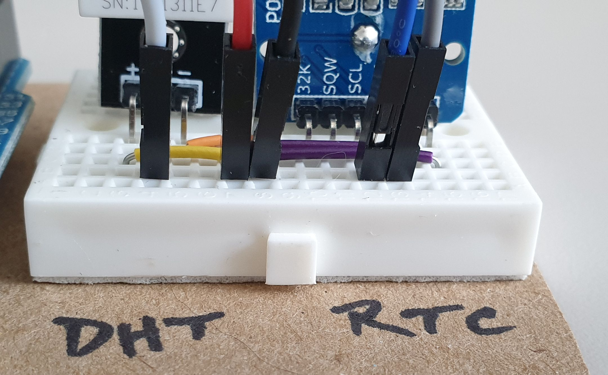
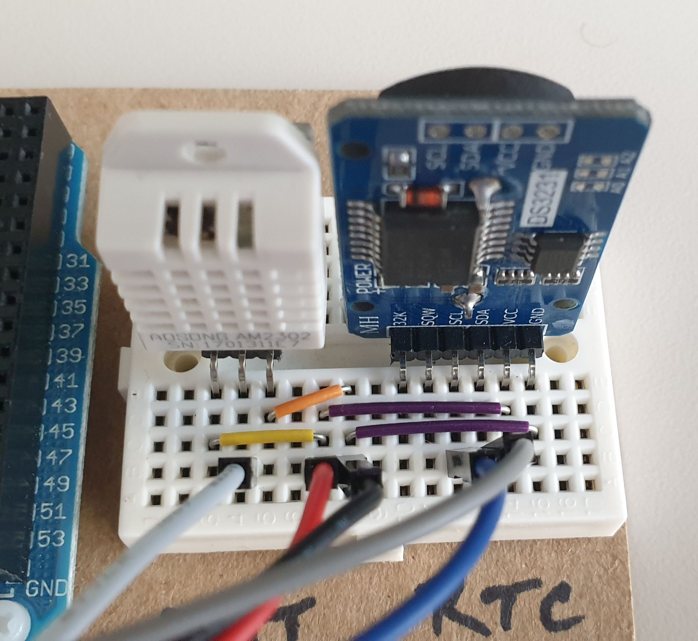
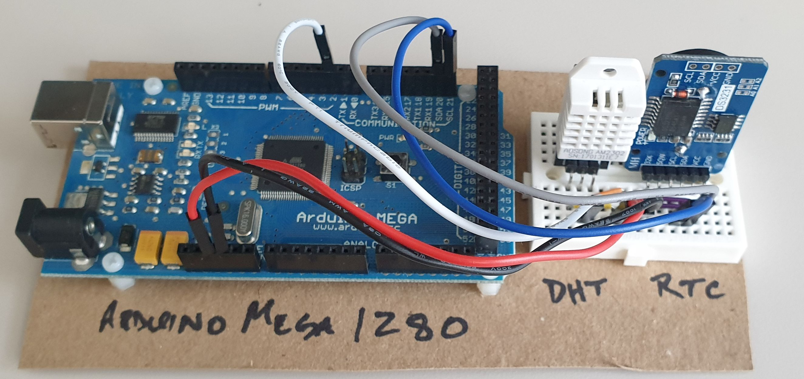
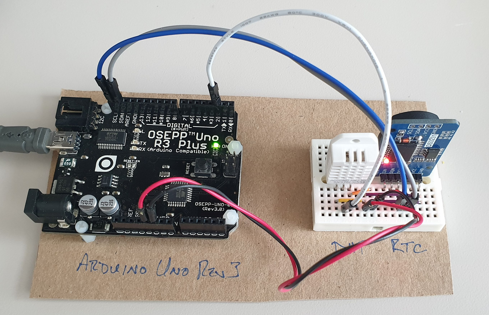

# Assembly of the hardware

Report time, humidity, and temperature using Arduino.

This page documents photographs of the hardware assembly and other
details.

In the photos shown below, the Arduino controller is on the left, the breadboard on the right.  On the breadboard, the DHT22 is on the left, thr RTC is on the right, and the connections from the Arduino are in the foreground.

## Wiring

Should any of the wiring become detached, consult the close-up photos
provided in the images directory.

## DHT22 Temperature and humidity sensor

This is the 3-pin white component, marked as `AM2302` (an alternative
name for this component).)  Align the `out` (middle) pin of the 3-pin
connector with the white wire from the Arduino (digital pin 2).

DHT22 pin | Arduino connection | wire color
--- | --- | ---
DHT22 `+` | `3.3v` or `5v` | red
DHT22 `out` | `digital 2` | white
DHT22 `-` | `GND` | black

 

## DS3231 real-time-clock (RTC)

The RTC (the 6-pin blue component with the 2.0 cm, 3.2 VDC, CR2032
button battery) is mounted directly to the breadboard (as shown below),
matching the pins to the connections. Align the RTC's `GND` pin with the
right-most board wire connection on the breadboard.

A CR2032 battery is provided to keep the clock while the power is off.
When power is provided by the Arduino, the battery is not used.

DS3231 pin | Arduino connection | wire color
--- | --- | ---
DS3231 `SDA` | `SDA` | grey
DS3231 `SCL` | `SCL` | blue
DS3231 `VCC` | `3.3v` or `5v` | red
DS3231 `GND` | `GND` | black

## Breadboard

The chosen breadboards did not have a cross-bus for *Vcc* or *Gnd*
connections.  (They were very cheap!)  Local jumper wire was used to
connect between the components on the board and the common wire
connection from the Arduino. Somehow, it was possible to avoid crossing
the wires above the breadboard.

## Arduino

Two versions of this project have been created using different versions of the Arduino hardware.  The same firmware was used in both:

1. Arduino Mega 1280 (the only one left on the shelf)
2. Arduino Uno Rev3

The same reporting behavior is expected from either hardware version.

### Arduino Mega 1280

Here is a photo of the Arduino Mega 1280, fully assembled and connected to host computer USB port.  It is fully powered with a steady green light on the Arduino and a steady red light on the RTC.

### Arduino Uno Rev3

